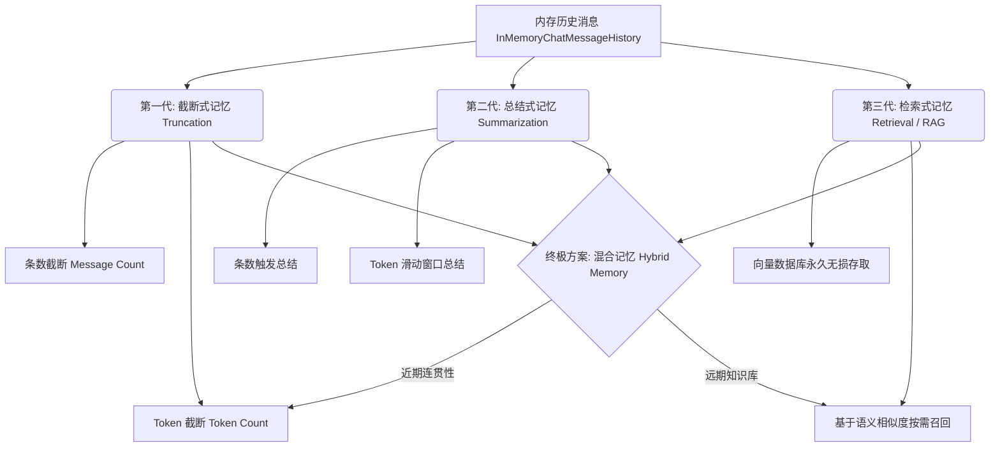

# LLM Agent 对话记忆策略演进实验 (Evolution of LLM Agent Conversational Memory)

这是一个用于深入探索和大语言模型（LLM）对话记忆机制的实验项目。本项目涵盖了从最简单的**截断式短期记忆**，到**总结式中期记忆**，再到**基于向量数据库的长期检索记忆**的完整演进过程，并深入探讨了生产环境中解决记忆不连贯问题的**混合记忆（Hybrid Memory）**最佳实践。

---

## 1. 记忆机制进化路线图

在构建智能体（Agent）或聊天机器人（Chatbot）时，如何让大模型拥有记忆是核心议题。本项目通过 5 个模块展示了这一技术栈的演进：



---

## 2. 认知科学与记忆层级对比

在智能体架构中，我们可以对照人类大脑的记忆系统，对这几种模式进行层级划分：

| 记忆模式 | 存储介质 | 认知科学定位 | 优点 | 缺点 | 适用场景 |
| :--- | :--- | :--- | :--- | :--- | :--- |
| **内存/持久化 Buffer** | 内存 / 本地文件 | **工作记忆 (Working Memory)** | 100% 无损，极速读写，时序逻辑极强 | 受大模型上下文限制，容易爆窗口，Token 费用随对话飙升 | 临时的短会话、简单的单轮交互 |
| **总结压缩记忆** | 内存 / 本地文件 | **中期概括记忆 (Mid-term Memory)** | 延展了对话周期，降低了上下文 Token 长度 | 随着对话轮次增加，旧记忆在总结中会被不断模糊稀释，**细节严重损耗** | 针对较长周期会话，但不需要精确细节回溯的场景 |
| **向量检索记忆** | 向量数据库 (Milvus) | **长期情节/事实记忆 (Long-term Memory)** | 永久保存，**细节无损**，按需精准召回，Token 利用率极高 | 丢失了时间线上的**连续对话时序**，容易产生“代词指代丢失”导致记忆不连贯 | 跨度极长、超大信息量、需要随时调用很久以前特定细节的系统 |

---

## 3. 项目目录与文件解析

项目核心源码存放在 [src](file:///Users/aaxis/Documents/code/agent/memory-test/src) 目录下，分类如下：

### 📁 截断与总结模块 (`src/memory/`)

*   **[truncation-memory.mjs](file:///Users/aaxis/Documents/code/agent/memory-test/src/memory/truncation-memory.mjs)**
    *   **数量截断演示**：直接通过数组 `slice(-maxMessages)` 暴力保留最近的固定轮次对话。
    *   **Token 精确截断演示**：引入 `js-tiktoken` 编码器与 LangChain 的 `trimMessages` API。从最新的对话反向计算 Token，自动逐步削减溢出的最旧对话，直到总 Token 安全降到 `maxTokens` (100) 以下。
*   **[summarization-memory.mjs](file:///Users/aaxis/Documents/code/agent/memory-test/src/memory/summarization-memory.mjs)**
    *   **基础总结演示**：当消息总数超过阈值时，自动调用大模型对老旧对话进行归纳。将 Summary 作为第一条 `SystemMessage` 重新注入历史消息缓存顶部，只保留最近 2 条无损对话。
*   **[summarization-memory-by-token.mjs](file:///Users/aaxis/Documents/code/agent/memory-test/src/memory/summarization-memory-by-token.mjs)**
    *   **基于 Token 的滑动窗口总结演示**：当历史总 Token 超过 200 时，从最新消息逆序累加，在不超过 80 Token 的限制下无损保留最近的几条对话（消息粒度熔断），将剩余的前半段旧对话发送给大模型总结后归纳清理。

### 📁 向量检索长期记忆模块 (`src/memory/` & `src/`)

*   **[insert-conversations.mjs](file:///Users/aaxis/Documents/code/agent/memory-test/src/memory/insert-conversations.mjs)**
    *   **数据初始化工具**：连接本地 Milvus 服务，初始化一个维度为 1024 的向量集合 `conversations`，并使用 OpenAI Embeddings 模型生成多轮模拟对话的向量嵌入（包含职业、爱好、研究项目等事实数据），批量插入数据库。
*   **[retrieval-memory.mjs](file:///Users/aaxis/Documents/code/agent/memory-test/src/memory/retrieval-memory.mjs)**
    *   **RAG 长期记忆核心演示**：
        1. 接收当前用户的提问。
        2. 将问题转换为语义向量，去 Milvus 中检索最相关的 2 条历史记录（通过固定 `limit` 规避上下文膨胀，无需压缩总结）。
        3. 将检索到的事实拼接在 Context 提示词中发送给大模型，实现精准的历史事实唤醒。
        4. 对话结束后，自动把当前最新的问答转换为向量并增量插入 Milvus。
    *   **避坑指南注释**：在注释中深入剖析了纯语义检索记忆会因为“代词（它、那个）指代消解失败”而造成**记忆不连贯**的严重缺陷，并给出了**混合记忆机制 (Hybrid Memory)** 的行业标准标准设计方案。

---

## 4. 运行指引

### 环境准备

1.  复制 `.env` 配置文件并填入相应的大模型 API Key 与自定义 Endpoint：
    ```env
    MODEL_NAME=gpt-4o-mini
    OPENAI_API_KEY=your_openai_api_key
    OPENAI_BASE_URL=your_openai_base_url
    
    EMBEDDINGS_API_KEY=your_embeddings_api_key
    EMBEDDINGS_MODEL_NAME=text-embedding-3-large
    EMBEDDINGS_BASE_URL=your_embeddings_base_url
    ```
2.  确保本地已启动 Milvus 向量数据库（默认端口 `19530`）。
3.  使用包管理器安装依赖：
    ```bash
    pnpm install
    ```

### 执行实验

*   **运行短期/中期记忆演示**：
    ```bash
    node src/memory/truncation-memory.mjs
    node src/memory/summarization-memory.mjs
    node src/memory/summarization-memory-by-token.mjs
    ```
*   **运行长期检索记忆演示**：
    1. 首先插入预置背景对话数据：
       ```bash
       node src/memory/insert-conversations.mjs
       ```
    2. 执行检索与 RAG 问答模拟：
       ```bash
       node src/memory/retrieval-memory.mjs
       ```
